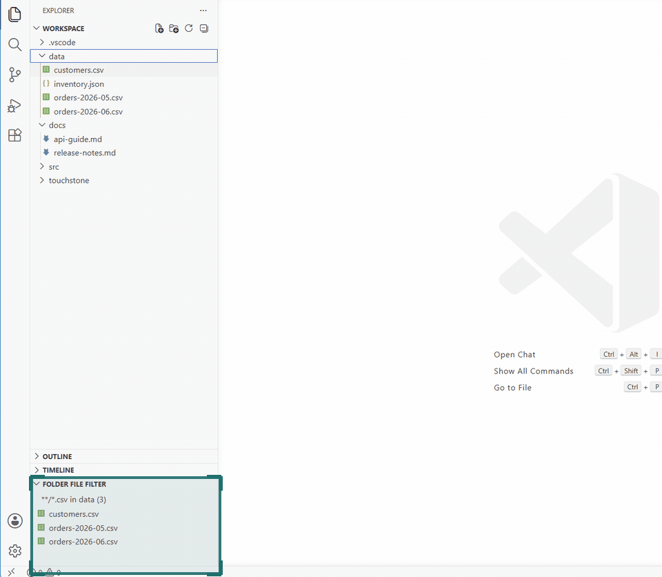
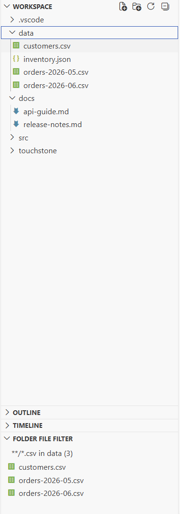

# Folder File Filter

Filter folder files by glob mask, file extension, or active file context inside VS Code Explorer.

[GitHub repository](https://github.com/applicate2628/vscode-folder-file-filter) | [VS Code Marketplace](https://marketplace.visualstudio.com/items?itemName=applicate2628.vscode-folder-file-filter)

## Why Use It

- Filter one folder by mask or extension without running a full workspace search.
- Browse matching neighbors directly in Explorer while keeping file opening predictable.
- Use the active file context to jump between related docs, configs, tests, logs, and assets.





## Features

- Adds a `Folder File Filter` view to the Explorer sidebar.
- Adds `Folder File Filter: Show Matching Files` to folder context menus in Explorer.
- Adds a `Folder File Filter` action to file context menus in Explorer.
- Adds `Folder File Filter: Open Settings` to the Command Palette.
- Prompts for a glob mask such as `**/*.md`, `**/*.json`, `**/*.test.ts`, `**/*.log`, or `**/*.png`.
- Shows matching files from the selected source folder as clickable tree items.
- Can infer one filter from multiple selected files, such as `{*.json,*.md}`.
- Supports native Ctrl/Shift multi-selection and result context-menu actions for open, open to side, reveal in File Explorer, and copy path.
- Can follow the active file tab and update the filter when a file with another extension is opened.
- Supports refresh and clear actions from the `Folder File Filter` view title.
- Can open the highlighted result while moving through the results list.

## Common Use Cases

- Filter docs such as `**/*.md`, `docs/**/*.md`, or `README*.md`.
- Filter configs such as `**/*.json`, `**/*.yaml`, `**/*.toml`, or `*.config.*`.
- Filter tests such as `**/*.test.ts`, `**/*.spec.js`, or `tests/**/*.py`.
- Filter logs, reports, screenshots, and generated assets without leaving Explorer.
- Right-click one or more files to infer a mask from their extensions and browse matching neighbors.

## Use

1. Open a workspace in VS Code.
2. Right-click a folder in Explorer.
3. Run `Folder File Filter: Show Matching Files`.
4. Enter a glob mask.
5. Open files from the `Folder File Filter` view.

For files, right-click a file in Explorer and run `Folder File Filter`. The command searches the selected file's parent folder using a mask inferred from the file name, such as `*.json` for `settings.json`. If several files are selected with Ctrl or Shift, the command combines their unique masks, such as `{*.json,*.md}`.
The `Folder File Filter` results view also supports native Ctrl/Shift multi-selection.

To open extension settings, run `Folder File Filter: Open Settings` from the Command Palette.

## Settings

```json
{
  "folderFileFilter.defaultMask": "**/*",
  "folderFileFilter.maxResults": 500,
  "folderFileFilter.openOnSelection": false,
  "folderFileFilter.autoFilterFilesFromSelectedFile": true,
  "folderFileFilter.autoFilterFromActiveFile": true,
  "folderFileFilter.restoreFocusAfterOpenDelayMs": 150
}
```

Enable `folderFileFilter.openOnSelection` to open the highlighted result while moving through the list with Up/Down. Files open with their default editor in preview mode and focus stays in the `Folder File Filter` view.
Disable `folderFileFilter.autoFilterFilesFromSelectedFile` to confirm or edit the inferred mask before the file context menu command runs.
Disable `folderFileFilter.autoFilterFromActiveFile` if opening a file in the editor should not update the active filter automatically.
Increase `folderFileFilter.restoreFocusAfterOpenDelayMs` if a custom editor takes focus after opening and interrupts Up/Down navigation.

## Privacy And Security

The extension searches local workspace files through the VS Code extension API and opens matches with VS Code's default editor selection. It does not upload files, make network requests, or collect telemetry.

## License

Commercial licensing is available separately.
Unless you have a separate commercial license agreement, this project is licensed under MPL-2.0.
See the repository `LICENSE` for the full MPL-2.0 text and `NOTICE` for copyright and commercial licensing notice.

## Terms and Abbreviations

- `Explorer`: the VS Code sidebar that shows workspace folders and contributed views.
- `Glob`: a path matching pattern such as `**/*.md`, `**/*.json`, or `**/*.test.ts`.
- `Command Palette`: the VS Code command launcher opened with commands such as `Show All Commands`.
- `Ctrl` and `Shift`: keyboard modifier keys used by VS Code Explorer for multi-selection.
- `Custom editor`: a VS Code editor provided by an extension for a specific file type.
- `MPL`: Mozilla Public License.
- `Telemetry`: automatic usage or diagnostic data collection; this extension does not collect it.
- `VS Code`: Visual Studio Code.
- `VS Code extension API`: the local API surface VS Code exposes to extensions.
